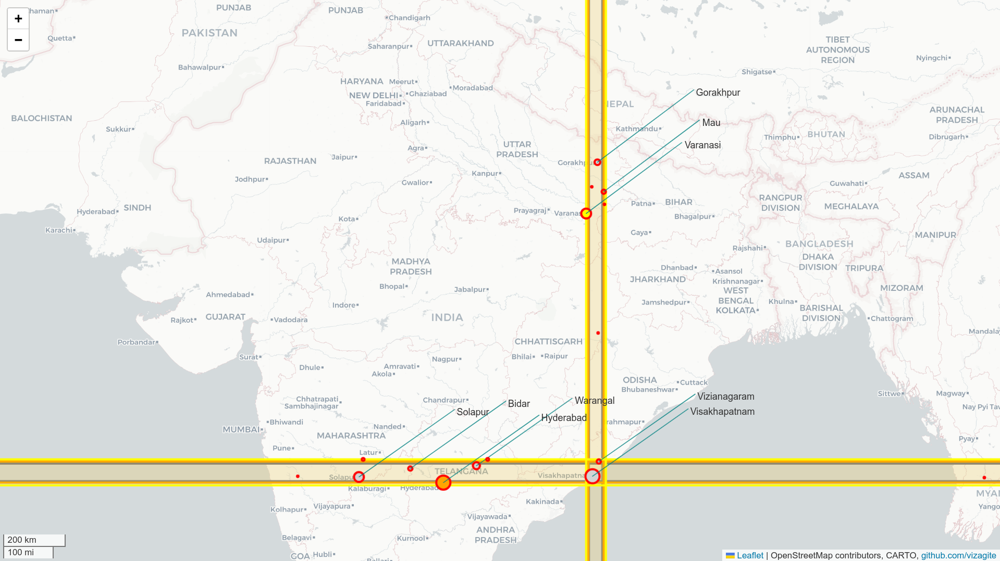
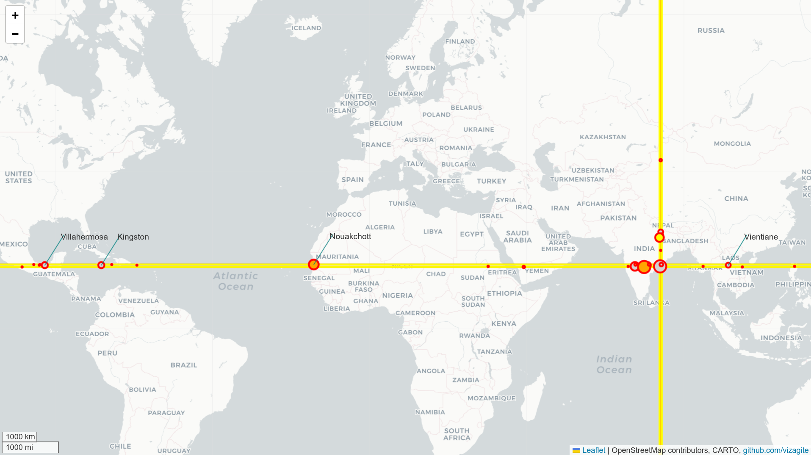

## What?

What other major cities lie across same latitude and longitude as Vizag city.

## Why?

It's fun, and if you think of cities sharing same latitude they mostly share same stargazing things and day durations. similarly, for cities sharing same longitude they mostly have same sunrise and sunset timings.

## How?

- Get major cities from [opendatasoft](https://public.opendatasoft.com/explore/dataset/geonames-all-cities-with-a-population-1000/table/?disjunctive.cou_name_en=&sort=name)
- Get latest vizag district geojson from overpass-openstreetmap
- Filter cities with 100000 population along latitude and longitudes of vizag boundaries
- Sanitize the data from usual online search of final cities
- Color each band with different color for 10% and 25% of vizag-boundary cities on both sides.
- Plot on world map with added llm descriptions of each city

## Caveats?

- The cities data above is just a preliminary data, and cities can split, merge, or have multiple individual names for each subpart
- A city coordinates in above data is just one number and it could be anywhere in city and may pass the bands, ideally we want to get boundaries of all cities crossing this line and filter, but
- \- we will employ a trick of 10% and 25% bands on both sides to include any cities nearby since those boundaries may largely overlap within above filters